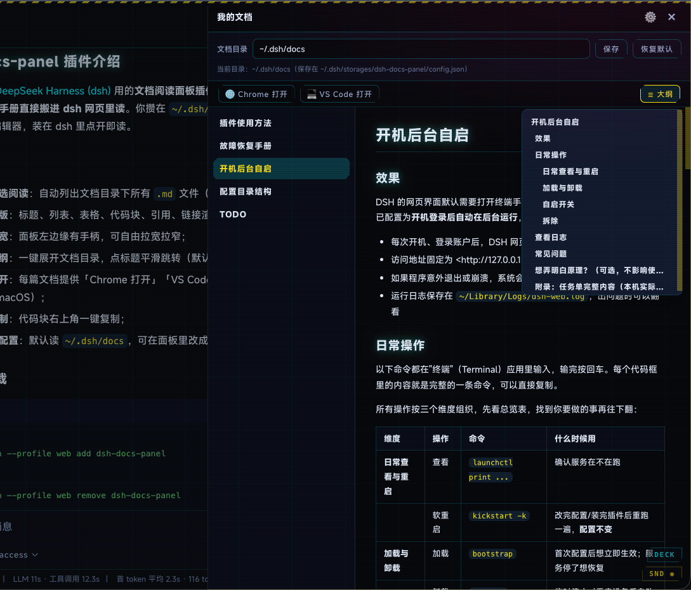

# dsh-docs-panel

> DSH WebUI 里的「随身手册」：全局 Markdown 笔记，任何工作区随时可读。

[](https://www.npmjs.com/package/dsh-docs-panel)
[](https://www.npmjs.com/package/dsh-docs-panel)
[](https://github.com/mlosun/dsh-docs-panel/blob/main/LICENSE)

把你自己整理的 Markdown 笔记，直接搬进 DeepSeek Harness 的网页里读。

你攒在 `~/.dsh/docs` 的笔记、排查手册、使用说明，不必再切到别的编辑器——装在 dsh 里就能点开即读：右侧滑出面板、排版干净的正文、随时跳转的大纲，读完一键就能转到 Chrome 或 VS Code 继续编辑。



## 功能一览

- 📚 **列表点选阅读**：自动列出文档目录下所有 `.md` 文件（含子目录），点一下就读；
- 🎨 **良好排版**：标题、列表、表格、代码块、引用、链接都渲染得规整，自动适配亮色/暗色主题；
- 📏 **拖拽调宽**：面板左边缘有手柄，自由拉宽拉窄；
- 🧭 **悬浮大纲**：一键展开文档目录，点标题平滑跳转（默认收起，不打扰阅读）；
- 🌐 **外部打开**：每篇文档提供「Chrome 打开」「VS Code 打开」按钮，随时转到编辑器继续编辑（目前仅支持 macOS）；
- 📋 **代码复制**：代码块右上角一键复制；
- 📁 **目录可配置**：默认读 `~/.dsh/docs`，可在面板里改成任何目录，保存后永久生效。

## 安装

在终端执行一条命令：

```bash
dsh plugin --profile web add dsh-docs-panel
```

这条命令会自动完成全部工作：从 npm 拉取插件包、登记到 dsh 的启动清单。**重启 dsh 后生效**（重启方式取决于你自己的启动方式，例如重新运行 `dsh web`）。

重启后打开 dsh 网页，右上角就有「我的文档」按钮了。**以后每次 dsh 启动都会自动加载，无需重新安装。**

## 卸载

在终端执行一条命令：

```bash
dsh plugin --profile web remove dsh-docs-panel
```

然后重启 dsh 生效。卸载会保留你的文档目录配置，重新安装后依然生效。

## 使用

1. 点右上角「我的文档」打开面板；
2. 左侧列表点选一篇文档，右侧阅读；
3. 右上角 ⚙️ 修改文档目录（默认 `~/.dsh/docs`，保存到 `~/.dsh/storages/dsh-docs-panel/config.json`）；
4. 「☰ 大纲」展开目录，「Chrome / VS Code 打开」转到编辑器；
5. 点 ✕ 或面板外区域关闭。

## 常见问题

**文档列表是空的？** 往 `~/.dsh/docs` 里放几个 `.md` 文件即可（也可以点 ⚙️ 指向你自己的目录）。

## 目录结构

```
.
├── lib/
│   ├── index.js          # 宿主端：配置、文档读取、外部打开、剪贴板、HTTP 接口
│   └── client.js         # 浏览器端：按钮、面板、大纲、Markdown 渲染器
├── assets/
│   └── demo-panel.png    # README 演示图（「我的文档」阅读面板）
├── cordis.patch.yml      # dsh 启动清单补丁
├── markdown-test.cjs     # 渲染器自测（node markdown-test.cjs）
├── LICENSE
└── package.json
```

## 开发

自测 Markdown 渲染器：`node markdown-test.cjs`

## 许可证

MIT
